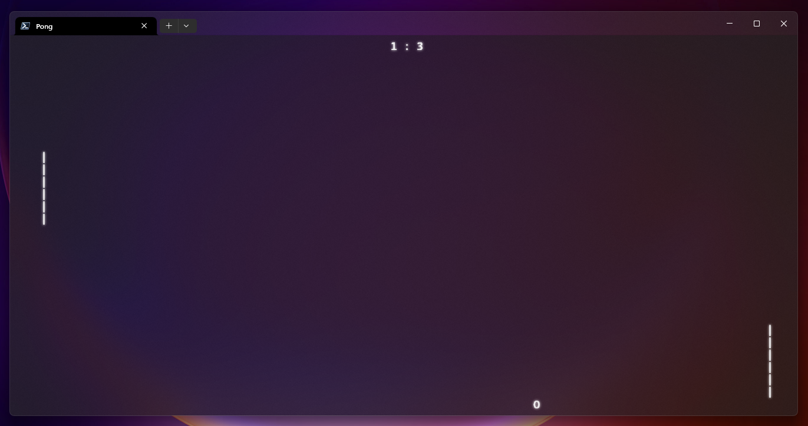

# Pong

This is a Pong clone that runs on the terminal. Currently supports Windows.

.NET core 7.0 is required to run the application using the following command:

```powershell
dotnet run
```

A release is available for Windows. Just execute the .exe file.



## How to play

Press arrow keys or `W` and `S` keys to move up and down.
